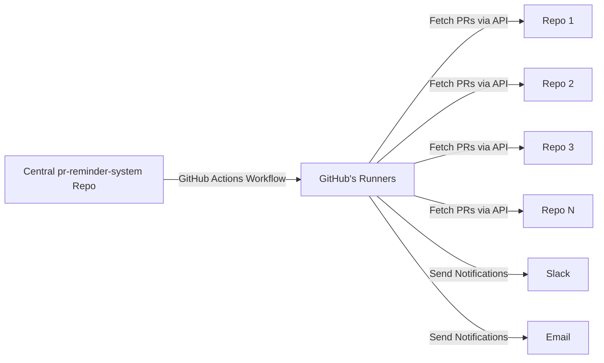

# How GitHub Actions Works - Explained

## What is GitHub Actions?

GitHub Actions is a **CI/CD platform built into GitHub** that runs code automatically based on events or schedules. Think of it as GitHub's own "server" that executes your code for free (within usage limits).

## Key Concepts

### 1. **No External Server Needed** ✅
- GitHub provides the compute resources (runners)
- Your code runs on GitHub's infrastructure
- **You don't need to host anything yourself**
- Free tier includes 2,000 minutes/month for private repos, unlimited for public repos

### 2. **Workflow Files**
- Workflows are defined in YAML files
- Located in `.github/workflows/` directory
- Each workflow file describes what to run and when

### 3. **Where to Put the Workflow**

For your PR reminder system, you have **two main options**:

#### **Option A: Single Central Repository (RECOMMENDED)** ⭐

```
pr-reminder-system/          ← Create ONE new repository
├── .github/
│   └── workflows/
│       └── pr-reminder.yml  ← Workflow runs here
├── scripts/
│   ├── fetch-prs.js
│   ├── notify-slack.js
│   └── notify-email.js
├── config.yml
└── package.json
```

**How it works:**
1. Create ONE new repository called `pr-reminder-system`
2. Add the workflow file to this repository
3. The workflow monitors ALL your other repositories from this central location
4. GitHub Actions runs the workflow on schedule (e.g., daily at 9 AM)
5. No need to modify any of your existing repositories

**Advantages:**
- ✅ Only one place to maintain
- ✅ Don't touch existing repositories
- ✅ Easy to update configuration
- ✅ Centralized logging and monitoring

#### **Option B: Distributed (Each Repository)**

```
repo-1/
├── .github/workflows/pr-reminder.yml
└── ...

repo-2/
├── .github/workflows/pr-reminder.yml
└── ...

repo-3/
├── .github/workflows/pr-reminder.yml
└── ...
```

**How it works:**
1. Add the same workflow file to EVERY repository
2. Each repository monitors only its own PRs
3. Results are aggregated somehow (more complex)

**Disadvantages:**
- ❌ Must update every repository
- ❌ Harder to maintain (changes needed in multiple places)
- ❌ More complex to aggregate data

## Recommended Architecture: Central Repository



### How the Central Repository Works

1. **Create the Repository**
   ```bash
   # Create a new repository on GitHub
   # Name it: pr-reminder-system
   ```

2. **Add Workflow File**
   ```yaml
   # .github/workflows/pr-reminder.yml
   name: PR Review Reminder
   
   on:
     schedule:
       - cron: '0 9 * * 1-5'  # Runs at 9 AM on weekdays
     workflow_dispatch:  # Allows manual trigger
   
   jobs:
     send-reminders:
       runs-on: ubuntu-latest
       steps:
         - uses: actions/checkout@v3
         - uses: actions/setup-node@v3
         - run: npm install
         - run: node scripts/fetch-prs.js
           env:
             GITHUB_TOKEN: ${{ secrets.GITHUB_TOKEN }}
             SLACK_WEBHOOK: ${{ secrets.SLACK_WEBHOOK_URL }}
   ```

3. **GitHub Actions Automatically:**
   - Detects the workflow file
   - Runs it on the schedule you defined
   - Provides a runner (virtual machine) to execute your code
   - Gives you a `GITHUB_TOKEN` to access GitHub API

4. **Your Script:**
   - Uses the GitHub API to fetch PRs from multiple repositories
   - Processes the data
   - Sends notifications

## Step-by-Step Setup Process

### Step 1: Create Central Repository
```bash
# On GitHub, create a new repository
Repository name: pr-reminder-system
Visibility: Private (recommended) or Public
```

### Step 2: Clone and Set Up Locally
```bash
git clone https://github.com/YOUR-ORG/pr-reminder-system.git
cd pr-reminder-system
```

### Step 3: Add Project Files
```
pr-reminder-system/
├── .github/
│   └── workflows/
│       └── pr-reminder.yml
├── scripts/
│   ├── fetch-prs.js
│   ├── notify-slack.js
│   └── notify-email.js
├── config.yml
├── package.json
└── README.md
```

### Step 4: Configure GitHub Secrets
In your repository settings on GitHub:
1. Go to Settings → Secrets and variables → Actions
2. Add secrets:
   - `GITHUB_TOKEN` (automatically provided by GitHub)
   - `SLACK_WEBHOOK_URL` (your Slack webhook)
   - `EMAIL_PASSWORD` (SMTP password)

### Step 5: Push and Enable
```bash
git add .
git commit -m "Initial setup"
git push origin main
```

GitHub Actions will automatically:
- Detect the workflow
- Enable it
- Run it on the schedule you defined

## Permissions and Access

### GitHub Token Permissions
The workflow needs permission to:
- Read PRs from other repositories
- Read repository metadata

**Two options:**

1. **Use default `GITHUB_TOKEN`** (Limited)
   - Only works for repositories in the same organization
   - Limited permissions

2. **Use Personal Access Token (PAT)** (Recommended)
   - Can access multiple organizations
   - More control over permissions
   - Create at: GitHub Settings → Developer settings → Personal access tokens
   - Required scopes: `repo` (for private repos) or `public_repo` (for public repos)

## Cost and Limits

### GitHub Actions Free Tier
- **Public repositories:** Unlimited minutes
- **Private repositories:** 2,000 minutes/month
- Your workflow will use ~1-2 minutes per run
- Daily runs = ~30-60 minutes/month (well within free tier)

### If You Exceed Free Tier
- Pay-as-you-go: $0.008 per minute
- Or upgrade to GitHub Team/Enterprise

## Testing Your Workflow

### Manual Trigger
You can test without waiting for the schedule:
1. Go to your repository on GitHub
2. Click "Actions" tab
3. Select your workflow
4. Click "Run workflow"

### View Logs
- All workflow runs are logged
- See exactly what happened
- Debug any issues

## Summary: What You Need to Do

1. ✅ **Create ONE new repository** (`pr-reminder-system`)
2. ✅ **Add workflow file** to `.github/workflows/`
3. ✅ **Add your scripts** (Node.js/Python)
4. ✅ **Configure secrets** in repository settings
5. ✅ **Push to GitHub**
6. ✅ **GitHub Actions handles the rest** - no server needed!

## Common Questions

**Q: Do I need to keep my computer running?**
A: No! GitHub's servers run the workflow.

**Q: Do I need to pay for hosting?**
A: No! GitHub Actions is free (within limits).

**Q: Can it access private repositories?**
A: Yes, with proper token permissions.

**Q: What if I want to change the schedule?**
A: Just edit the cron expression in the workflow file.

**Q: Can I run it manually?**
A: Yes, using `workflow_dispatch` trigger.

**Q: How do I see if it worked?**
A: Check the Actions tab in your repository for logs.