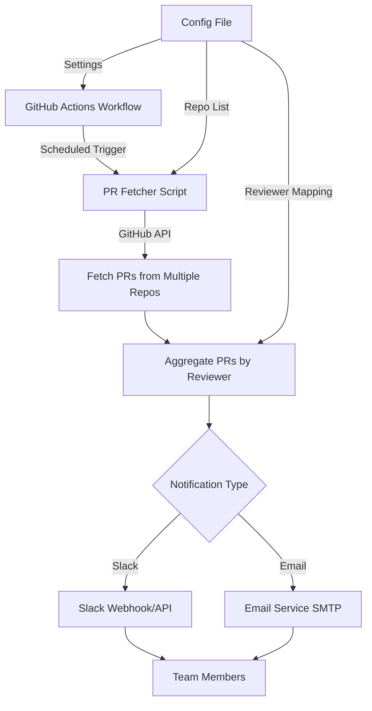

# PR Review Reminder System - Implementation Plan

## Overview
A GitHub Actions-based solution to automatically remind team members about pending PR reviews across multiple repositories via Slack and Email notifications.

## System Architecture



## Key Components

### 1. Configuration File Structure
**File:** [`config.yml`](config.yml)

```yaml
repositories:
  - owner: org-name
    repos:
      - repo-1
      - repo-2
      - repo-3

notification:
  frequency:
    slack: "0 9 * * 1-5"  # Weekdays at 9 AM
    email: "0 9 * * 1"     # Mondays at 9 AM
  
  slack:
    enabled: true
    webhook_url: ${{ secrets.SLACK_WEBHOOK_URL }}
    channel: "#pr-reviews"
  
  email:
    enabled: true
    smtp_server: smtp.gmail.com
    smtp_port: 587
    from_email: ${{ secrets.EMAIL_FROM }}
    smtp_password: ${{ secrets.EMAIL_PASSWORD }}

reviewers:
  - github_username: user1
    slack_id: U123456
    email: user1@company.com
  - github_username: user2
    slack_id: U789012
    email: user2@company.com
```

### 2. GitHub Actions Workflow
**File:** [`.github/workflows/pr-reminder.yml`](.github/workflows/pr-reminder.yml)

- Scheduled triggers using cron expressions
- Separate jobs for Slack and Email notifications
- Uses GitHub token for API access
- Stores sensitive data in GitHub Secrets

### 3. PR Fetcher Script
**File:** [`scripts/fetch-prs.js`](scripts/fetch-prs.js) or [`scripts/fetch-prs.py`](scripts/fetch-prs.py)

**Responsibilities:**
- Authenticate with GitHub API using token
- Iterate through configured repositories
- Fetch open PRs with requested reviewers
- Filter PRs by review status (pending, changes requested)
- Aggregate data by reviewer

**GitHub API Endpoints:**
- `GET /repos/{owner}/{repo}/pulls` - List pull requests
- `GET /repos/{owner}/{repo}/pulls/{pull_number}/reviews` - Get PR reviews
- `GET /repos/{owner}/{repo}/pulls/{pull_number}/requested_reviewers` - Get requested reviewers

### 4. Notification Modules

#### Slack Integration
**File:** [`scripts/notify-slack.js`](scripts/notify-slack.js)

**Features:**
- Rich message formatting with PR details
- Grouped by reviewer
- Direct links to PRs
- Summary statistics (total pending, oldest PR, etc.)

**Message Format:**
```
🔔 PR Review Reminder - [Date]

@user1 - You have 3 PRs pending review:
• [repo-1] Fix authentication bug (#123) - 2 days old
  https://github.com/org/repo-1/pull/123
• [repo-2] Add new feature (#456) - 1 day old
  https://github.com/org/repo-2/pull/456
• [repo-1] Update dependencies (#789) - 5 hours old
  https://github.com/org/repo-1/pull/789
```

#### Email Integration
**File:** [`scripts/notify-email.js`](scripts/notify-email.js)

**Features:**
- HTML formatted emails
- Individual emails per reviewer
- Summary table of pending PRs
- Configurable SMTP settings

**Email Template:**
- Subject: "PR Review Reminder - [X] PRs Pending"
- HTML body with styled table
- Links to each PR
- Priority indicators (age-based)

### 5. Data Aggregation Logic
**File:** [`scripts/aggregate-prs.js`](scripts/aggregate-prs.js)

**Processing Steps:**
1. Collect all PRs from multiple repositories
2. Extract reviewer information
3. Group PRs by reviewer username
4. Calculate PR age and priority
5. Sort by age (oldest first)
6. Map GitHub usernames to Slack IDs and emails

## Implementation Details

### GitHub API Authentication
- Use `GITHUB_TOKEN` provided by GitHub Actions
- For cross-organization access, use Personal Access Token (PAT)
- Store tokens in GitHub Secrets

### Notification Frequency Options
- **Daily:** Weekday mornings (e.g., 9 AM)
- **Weekly:** Monday mornings
- **Custom:** Configurable cron expressions
- **Different schedules** for Slack vs Email

### Error Handling
- Graceful failure if API rate limits hit
- Retry logic for network failures
- Logging for debugging
- Fallback notifications if primary method fails

### Security Considerations
- All sensitive data in GitHub Secrets
- No hardcoded credentials
- Minimal permissions for GitHub token
- Secure SMTP connection (TLS)

## Technology Stack

### Primary Language Options
**Option 1: Node.js/TypeScript**
- Pros: Native GitHub Actions support, rich ecosystem
- Libraries: `@octokit/rest`, `nodemailer`, `@slack/webhook`

**Option 2: Python**
- Pros: Simple syntax, excellent for scripting
- Libraries: `PyGithub`, `smtplib`, `slack-sdk`

**Recommendation:** Node.js for better GitHub Actions integration

### Dependencies
```json
{
  "@octokit/rest": "^19.0.0",
  "@slack/webhook": "^6.1.0",
  "nodemailer": "^6.9.0",
  "js-yaml": "^4.1.0"
}
```

## Deployment Strategy

### Setup Steps
1. Create a central repository for the reminder system
2. Add configuration file with repository list
3. Configure GitHub Secrets:
   - `GITHUB_TOKEN` or `PAT_TOKEN`
   - `SLACK_WEBHOOK_URL`
   - `EMAIL_FROM`
   - `EMAIL_PASSWORD`
4. Enable GitHub Actions workflow
5. Test with dry-run mode

### Multi-Repository Support
**Option A: Central Repository**
- Single workflow in one repo
- Monitors all configured repositories
- Easier to maintain

**Option B: Distributed Workflows**
- Each repo has its own workflow
- Reports to central notification service
- More complex but more flexible

**Recommendation:** Option A (Central Repository)

## Advanced Features (Future Enhancements)

### Phase 2 Features
- [ ] Web dashboard for viewing pending PRs
- [ ] Customizable reminder thresholds (e.g., only PRs > 2 days old)
- [ ] Integration with Microsoft Teams
- [ ] PR review statistics and analytics
- [ ] Snooze functionality for specific PRs
- [ ] Escalation to managers for overdue reviews

### Phase 3 Features
- [ ] AI-powered reviewer suggestions
- [ ] Workload balancing across team members
- [ ] Integration with project management tools (Jira, Linear)
- [ ] Custom notification rules per repository
- [ ] Mobile app notifications

## Testing Strategy

### Unit Tests
- Test PR fetching logic
- Test data aggregation
- Test notification formatting

### Integration Tests
- Test GitHub API integration
- Test Slack webhook delivery
- Test email sending

### End-to-End Tests
- Full workflow execution
- Verify notifications received
- Test with multiple repositories

## Monitoring and Maintenance

### Logging
- Log all API calls
- Track notification delivery status
- Record errors and failures

### Metrics to Track
- Number of PRs processed
- Notification delivery success rate
- API rate limit usage
- Average PR age

### Maintenance Tasks
- Update dependencies regularly
- Monitor GitHub API changes
- Review and update reviewer mappings
- Adjust notification frequency based on feedback

## Estimated Timeline

| Phase | Tasks | Duration |
|-------|-------|----------|
| Setup & Research | API exploration, tool selection | 1-2 days |
| Core Development | PR fetching, aggregation logic | 2-3 days |
| Notification Integration | Slack + Email implementation | 2-3 days |
| Testing & Refinement | Testing, bug fixes, documentation | 2-3 days |
| **Total** | | **7-11 days** |

## Success Criteria

- ✅ Successfully fetch PRs from multiple repositories
- ✅ Accurately identify pending reviewers
- ✅ Deliver notifications via Slack and Email
- ✅ Configurable notification frequency
- ✅ Clear documentation for setup and usage
- ✅ Reliable execution with error handling
- ✅ Positive team feedback on usefulness

## Next Steps

1. Review and approve this plan
2. Set up the project repository structure
3. Begin implementation starting with PR fetching logic
4. Iterate based on team feedback