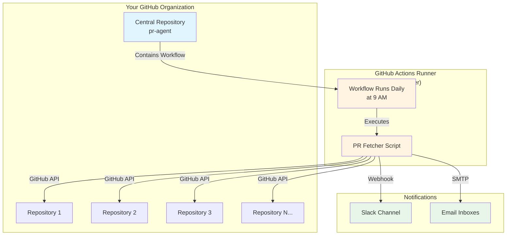
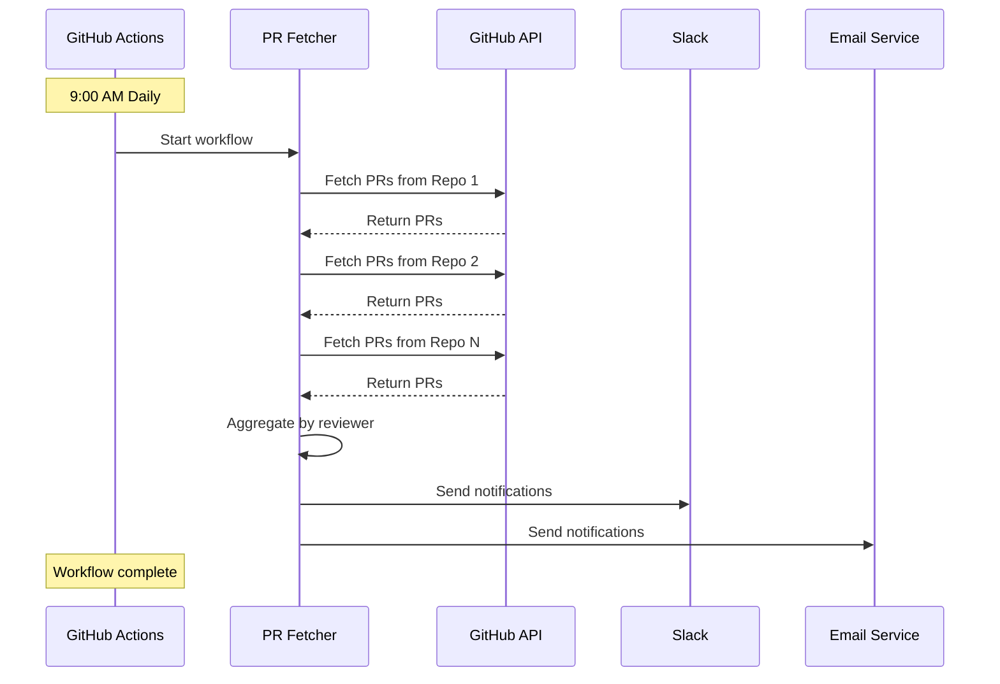

# PR Agent - Quick Setup Guide

## Overview

PR Agent uses **ONE central repository** with GitHub Actions to monitor PRs across **ALL your repositories** and send notifications via Slack and Email.

## Architecture Diagram



## What You Need

### 1. Create ONE New Repository
- Name: `pr-agent` (or any name you prefer)
- This is the ONLY repository you need to create
- All other repositories remain untouched

### 2. Required Secrets (in the new repository)
- `PAT_TOKEN` - Personal Access Token with `repo` scope
- `SLACK_WEBHOOK_URL` - Your Slack incoming webhook URL
- `EMAIL_PASSWORD` - SMTP password for sending emails

### 3. Configuration File
- List all repositories you want to monitor
- Map GitHub usernames to Slack IDs and emails
- Set notification schedules

## File Structure

```
pr-reminder-system/
├── .github/
│   └── workflows/
│       └── pr-reminder.yml          ← GitHub Actions workflow
├── scripts/
│   ├── fetch-prs.js                 ← Fetches PRs from all repos
│   ├── aggregate-data.js            ← Groups PRs by reviewer
│   ├── notify-slack.js              ← Sends Slack messages
│   └── notify-email.js              ← Sends emails
├── config.yml                       ← Configuration file
├── package.json                     ← Dependencies
└── README.md                        ← Documentation
```

## How It Works

### Daily Workflow Execution



## Setup Steps

### Step 1: Create Repository on GitHub
1. Go to GitHub.com
2. Click "New repository"
3. Name: `pr-reminder-system`
4. Visibility: Private (recommended)
5. Click "Create repository"

### Step 2: Create Personal Access Token
1. Go to GitHub Settings → Developer settings → Personal access tokens → Tokens (classic)
2. Click "Generate new token (classic)"
3. Name: "PR Reminder System"
4. Select scopes:
   - ✅ `repo` (Full control of private repositories)
5. Click "Generate token"
6. **Copy the token** (you won't see it again!)

### Step 3: Add Secrets to Repository
1. Go to your `pr-reminder-system` repository
2. Settings → Secrets and variables → Actions
3. Click "New repository secret"
4. Add these secrets:
   - Name: `PAT_TOKEN`, Value: (paste your token)
   - Name: `SLACK_WEBHOOK_URL`, Value: (your Slack webhook)
   - Name: `EMAIL_PASSWORD`, Value: (your SMTP password)

### Step 4: Get Slack Webhook URL
1. Go to https://api.slack.com/apps
2. Create a new app or select existing
3. Enable "Incoming Webhooks"
4. Add webhook to your channel
5. Copy the webhook URL

### Step 5: Clone and Set Up Project
```bash
# Clone the repository
git clone https://github.com/YOUR-ORG/pr-reminder-system.git
cd pr-reminder-system

# Create directory structure
mkdir -p .github/workflows scripts

# Add files (we'll create these in implementation phase)
# - .github/workflows/pr-reminder.yml
# - scripts/fetch-prs.js
# - scripts/notify-slack.js
# - scripts/notify-email.js
# - config.yml
# - package.json
```

### Step 6: Configure Repositories to Monitor
Edit `config.yml`:
```yaml
repositories:
  - owner: your-org-name
    repos:
      - repo-1
      - repo-2
      - repo-3

reviewers:
  - github_username: john_doe
    slack_id: U123456789
    email: john@company.com
  - github_username: jane_smith
    slack_id: U987654321
    email: jane@company.com
```

### Step 7: Push and Enable
```bash
git add .
git commit -m "Initial setup of PR reminder system"
git push origin main
```

### Step 8: Test the Workflow
1. Go to your repository on GitHub
2. Click "Actions" tab
3. Select "PR Review Reminder" workflow
4. Click "Run workflow" → "Run workflow"
5. Wait for completion
6. Check logs and notifications

## Configuration Options

### Notification Schedules

```yaml
notification:
  frequency:
    # Cron format: minute hour day month weekday
    slack: "0 9 * * 1-5"   # Weekdays at 9 AM
    email: "0 9 * * 1"     # Mondays at 9 AM
```

**Common Schedules:**
- `0 9 * * 1-5` - Weekdays at 9 AM
- `0 9 * * 1` - Every Monday at 9 AM
- `0 9,15 * * 1-5` - Weekdays at 9 AM and 3 PM
- `0 9 * * *` - Every day at 9 AM

### Notification Channels

```yaml
notification:
  slack:
    enabled: true
    channel: "#pr-reviews"
  
  email:
    enabled: true
    smtp_server: smtp.gmail.com
    smtp_port: 587
```

## Monitoring and Logs

### View Workflow Runs
1. Go to repository → Actions tab
2. See all workflow runs
3. Click on a run to see detailed logs
4. Debug any issues

### Workflow Status
- ✅ Green checkmark = Success
- ❌ Red X = Failed
- 🟡 Yellow dot = In progress

## Troubleshooting

### Common Issues

**Issue: Workflow not running**
- Check if workflow file is in `.github/workflows/`
- Verify cron syntax is correct
- Ensure repository has Actions enabled

**Issue: Can't access other repositories**
- Verify PAT_TOKEN has `repo` scope
- Check token hasn't expired
- Ensure token is added to secrets

**Issue: Slack notifications not working**
- Verify webhook URL is correct
- Check Slack app permissions
- Test webhook with curl

**Issue: Email not sending**
- Verify SMTP credentials
- Check if 2FA requires app password
- Test SMTP connection

## Cost Estimate

### GitHub Actions Usage
- **Workflow duration:** ~2 minutes per run
- **Daily runs:** 1 run/day = 30 runs/month
- **Monthly usage:** ~60 minutes/month
- **Free tier:** 2,000 minutes/month
- **Cost:** $0 (well within free tier)

### Scaling
- Monitoring 50 repositories: ~5 minutes/run
- Daily runs: ~150 minutes/month
- Still free!

## Next Steps

Once you're comfortable with this plan:
1. Review the detailed implementation plan in `PR_REMINDER_SYSTEM_PLAN.md`
2. Approve the approach
3. Switch to Code mode to implement the solution
4. Test with your repositories
5. Roll out to your team

## Questions?

Common questions answered in `GITHUB_ACTIONS_EXPLAINED.md`